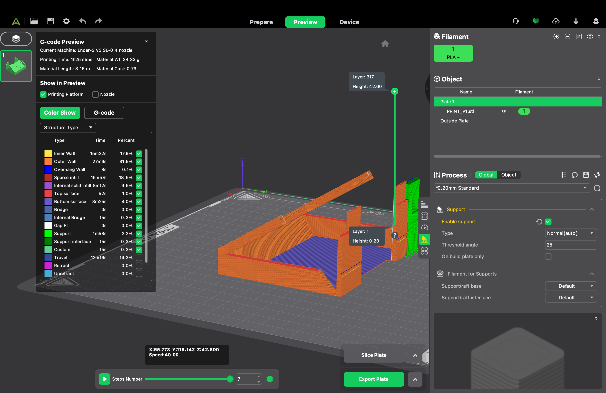

# ESP32 NFC Reader

This project provides a custom NFC reader solution using an ESP32 microcontroller. The reader can identify NFC tags, display information on a TFT-LED screen, and track usage data through a remote database.

## Abstract

This project offers a physical "tap-on" device to enhance engagement with a digital currency system, similar to the system used by Timezone. This solution is financially viable, with an estimated electronics cost of $10.71 per unit. The system utilises an ESP32 with WiFi for API-based validation and is powered by a wall socket, with a portable version available upon request.

## Features

- **NFC Tag Reading:** Reads data from various NFC tags.
- **User Interface:** Displays dynamic data on a ILI9341 TFT-LED screen.
- **Remote Data Logging:** Tracks NFC tag usage via a remote database using a RESTful API.
- **Custom Enclosure:** A 3D-printed enclosure designed in Fusion 360 houses the electronic components.

## Hardware Components

| Component         | Model                       | Price (AUD)      | Pin Group        | Pin              |
| ----------------- | --------------------------- | ---------------- | ---------------- | ---------------- |
| **Main**          | ESP32 Wroom 32 DevKit V1    | $4.40            | n/a              | n/a              |
| **TFT LED Display** | ILI9341                     | $11.98           | SPI            | MOSI (GP 23), MISO (GP 19), SCK (GPIO 18),CS (GPIO 5), DC (GPIO 16), LED (GPIO 25) [DAC], RST (GPIO 17) |
| **NFC Reader**    | PN532                       | $5.05            | I2C              | SDA (GPIO 21), SCL (GPIO 22) |
| **Total**         |                             | **$21.43**       | n/a              | n/a              |

## Software and Libraries

- **Firmware:** Developed in C++ for the ESP32.
- **TFT LED Library:** [https://github.com/schreibfaul1/ESP32-TFT-Library-ILI9341-HX8347D](https://github.com/schreibfaul1/ESP32-TFT-Library-ILI9341-HX8347D)
- **PN532 Library:** [https://github.com/adafruit/Adafruit-PN532](https://github.com/adafruit/Adafruit-PN532)
- **API:** A RESTful API built with Express.js and hosted on Vercel.
- **Database:** Supabase PostgreSQL backend.

## Pinouts

Due to the ESP32's pin constraints, where ADC2 pins are unusable while WiFi is active (refer to ESP32 pinout, HSPI is unvaliable, use VSPI), insure you follow the pinouts.
")
")

## Case
- ** Use for the base holder PrototypeShell.stl
- ** Use FullPrint.stl for the full holder


## Getting Started

To get a local copy up and running, follow these simple steps.

### Prerequisites

- Arduino IDE or a similar platform for ESP32 development (e.g., PlatformIO).
- The necessary libraries mentioned in the "Software and Libraries" section.

### Installation

1.  Clone the repository:
    ```sh
    git clone https://github.com/Nightclaus/esp32_nfc_reader.git
    ```
2.  Open the project in your preferred IDE.
3.  Install the required libraries.
4.  Configure the hardware connections as per the provided diagrams and pin configurations.
5.  Upload the firmware to your ESP32.

## Usage

Once the device is assembled and the firmware is loaded, it is ready to use. Power on the device and tap an NFC card on the PN532 reader. The data from the card will be displayed on the screen and the interaction will be logged remotely to the database via the API.
